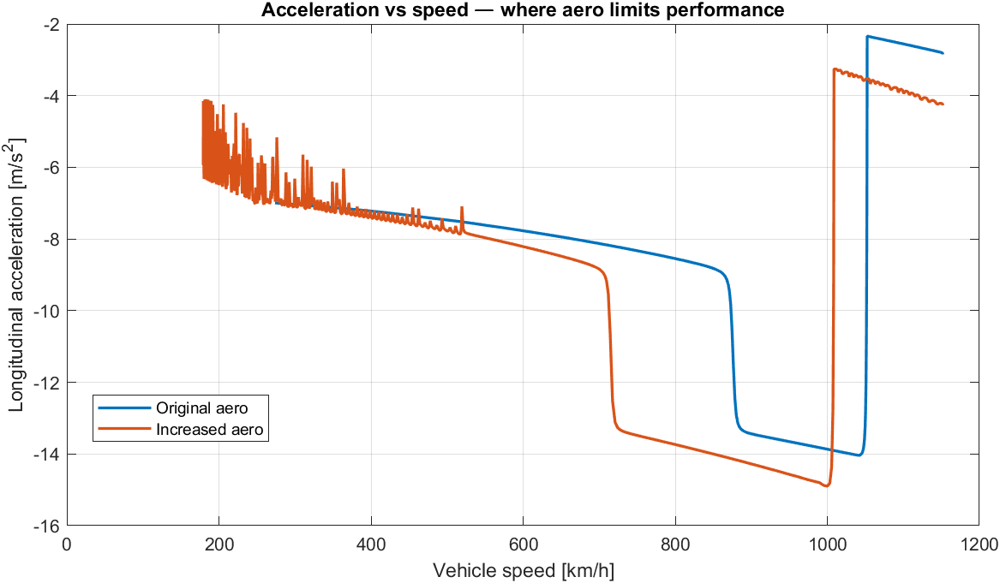
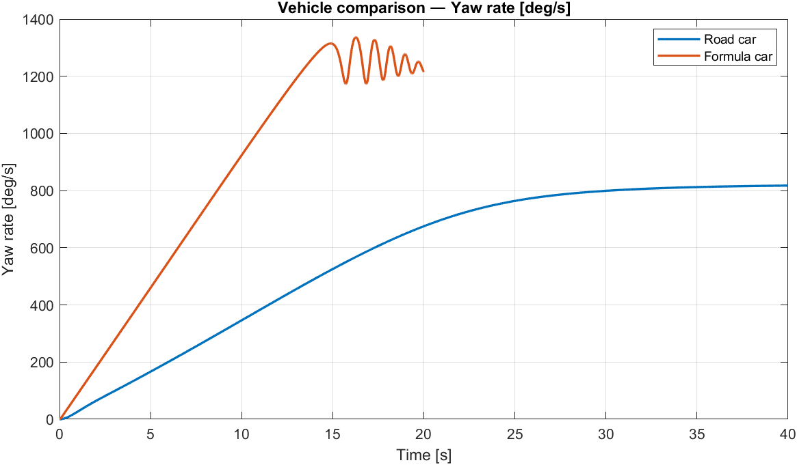
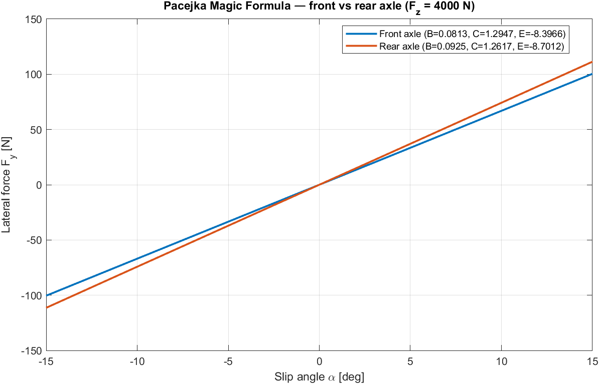

# Vehicle Dynamics Models — MATLAB & Simulink

A MATLAB / Simulink toolkit covering the standard vehicle-dynamics modelling progression — from a quarter-car ride model up to a 14-DoF full-vehicle model — built during the M.Sc. Vehicle Engineering programme at Hochschule Trier and used as the simulation backbone for the [GT3 Lap Time Simulator](https://github.com/jaykumarpatil9099/gt3-lap-time-simulator).

## What's in here

| Model | DoFs | Domain | Purpose |
|---|---|---|---|
| Quarter-car | 2 | Ride | Single-corner spring/damper response, road input |
| 4-DoF half-car | 4 | Ride | Bounce + pitch coupling |
| 7-DoF shaker rig | 7 | Ride | Full-car ride (heave, pitch, roll + 4 unsprung) |
| 10-DoF shaker rig | 10 | Ride | Extended shaker with additional unsprung dynamics |
| **14-DoF full vehicle** | **14** | **Ride + handling** | **Centerpiece — body + per-corner unsprung + wheel rotation, with drivetrain, brakes, ARBs, Pacejka tyres** |
| Bicycle (single-track) | 2 | Handling | Linear yaw response, understeer gradient |
| Longitudinal driving | 1 | Powertrain | Acceleration with 8-speed gearbox and engine map |
| Longitudinal braking | 1 | Brakes | Deceleration with adjustable F/R brake balance |
| Pacejka tyre library | — | Tyre | Lateral, longitudinal, and combined-slip Magic Formula |

The shorter models exist deliberately: each one isolates a subset of the physics so it can be validated independently before being composed into the 14-DoF model. The progression mirrors the classical VD curriculum (Genta, Pacejka, Milliken).

## The 14-DoF model

The full-vehicle model couples sprung-mass body dynamics (heave, pitch, roll), per-corner unsprung mass dynamics, and wheel rotational dynamics for traction and braking, with longitudinal and lateral motion under driver and aerodynamic inputs. Subsystems include:

- **Suspension:** independent corner spring + damper + anti-roll bar coupling per axle
- **Tyres:** Pacejka Magic Formula with separate front and rear coefficients (`Bf, Cf, Ef` vs `Br, Cr, Er`)
- **Drivetrain:** 8-speed sequential gearbox with normalised engine map (5 throttle × 15 rpm grid, max 250 Nm, 15 000 rpm limit, configurable up/down shift points)
- **Brakes:** torque-mapped pedal input with adjustable front/rear balance (default 65/35)
- **Aerodynamics:** downforce and drag with frontal area and density inputs

**Default vehicle parameters** describe a formula-class car: 850 kg sprung mass, 3.5 m wheelbase, ~1.0 downforce coefficient, race-spec suspension (front 67.5 N/mm, rear 100 N/mm), stiff front ARB (5000 Nm/rad) vs softer rear (1000 Nm/rad). Per-axle Pacejka coefficients differentiated to reflect real race-car tyre asymmetry.

### Studies included

Two pre-computed parametric sweeps are saved in `results/data/`. Plots in `figures/` are generated from these by the scripts under "Reproducing the figures."

**Aero study — longitudinal performance** (`out_original_aero.mat` vs `out_increased_aero.mat`)
Straight-line acceleration test with two aero configurations. Shows how added downforce / drag affects longitudinal acceleration, top speed reached, and front / rear tyre slip ratios. The headline finding is on the acceleration-vs-speed plot below — drag begins limiting the available longitudinal force at high speed.



**Vehicle comparison — handling response** (`out_roadcar.mat` vs `out_formulacar.mat`)
Handling-domain manoeuvre with two parameter sets — road car (1650 kg, 2.8 m wheelbase, no downforce) vs formula-class (850 kg, 3.5 m wheelbase, ~1.0 downforce). Logged channels: steering angle, yaw rate, lateral acceleration, side-slip, X/Y trajectory.



## Frequency-domain analysis

`shared/fft_VD.m` is a reusable FFT helper with automatic zero-padding to the next power of two. The included `figures/plot_fft_modes.m` demonstrates it on yaw rate and lateral acceleration from the handling study, identifying handling-domain natural frequencies.

To produce the classical body-mode (1–3 Hz) and wheel-hop (10–18 Hz) spectra, log vertical signals (`sprung_z`, `unsprung_z`) from one of the shaker-rig models (`03_dof7_shaker/`, `04_dof10_shaker/`) and point the same FFT helper at those signals.

## Pacejka tyre library

Lateral, longitudinal, and combined-slip implementations of the Magic Formula. Coefficients (`B`, `C`, `E`, peak value) exposed as parameters so the same blocks can be re-tuned for different tyre types — formula slick, road tyre, etc. The 14-DoF and bicycle models both consume them. A standalone extraction is planned as part of the v06 extension to the [GT3 Lap Time Simulator](https://github.com/jaykumarpatil9099/gt3-lap-time-simulator), where the simplified `μ(Fz)` surrogate currently used for QSS will be replaced with this slip-curve model.



## Reproducing the figures

There are two paths depending on whether you want to re-run the simulations or just regenerate plots from the saved data.

**To regenerate plots from the saved `.mat` files:**

```matlab
addpath(genpath('shared'))
cd figures
plot_aero_comparison       % overlays original vs increased aero
plot_vehicle_comparison    % overlays road-car vs formula-car runs
plot_pacejka_curves        % analytical front-vs-rear Pacejka + load family
plot_fft_modes             % FFT for body modes and wheel-hop
```

**To re-run a model from scratch:**

1. Open the model `.slx` in MATLAB / Simulink (built and tested in R2024a)
2. Run the matching `*_parameters.m` script in the same folder to populate the workspace
3. `addpath(genpath('shared'))` so `fft_VD.m` is reachable
4. Run the simulation; built-in scopes plot ride/handling responses live, and signal logging populates the workspace `out` object

`figures/INSTRUCTIONS.md` walks through every plot the README references and what to adjust if a logged-signal name in your model differs from the script defaults.

## File map

```
vehicle-dynamics-models-matlab-simulink/
├── README.md                  # this file
├── 01_quarter_car/            # Quarter_car_model.slx + _parameters.m
├── 02_dof4/                   # DOF4_model.slx + _parameters.m
├── 03_dof7_shaker/            # Suspension_shaker_rig_model.slx + _parameters.m
├── 04_dof10_shaker/           # DOF10_Suspension_shaker_rig_model.slx + _parameters.m
├── 05_dof14_full_vehicle/     # Complete_vehicle_simulation_dof14_model.slx + _parameters.m
├── 06_bicycle/                # Bicycle_model.slx + _parameters_formula.m
├── 07_longitudinal/           # Driving_dynamics_model.slx, Braking_dynamics_model.slx + _parameters.m
├── 08_pacejka_tyres/          # Pacejka tyre models (lateral, longitudinal, combined)
├── shared/                    # fft_VD.m, get_signal.m (common helpers)
├── results/
│   └── data/                  # .mat output files from parametric studies
└── figures/                   # plotting scripts + generated PNGs
    ├── INSTRUCTIONS.md
    ├── plot_aero_comparison.m
    ├── plot_vehicle_comparison.m
    ├── plot_pacejka_curves.m
    └── plot_fft_modes.m
```

## Methodological notes

- **Per-axle Pacejka asymmetry.** The 14-DoF uses different Magic Formula coefficients front and rear (`Cf=1.2947, Bf=0.0813, Ef=-8.3966` vs `Cr=1.2617, Br=0.0925, Er=-8.7012`). This is intentional — real race tyres are tuned differently per axle, and using a single coefficient set hides understeer/oversteer balance behaviour.
- **ARB as redistribution, not reduction.** The front/rear ARB stiffness ratio (5000 / 1000 Nm/rad in the default set) controls how lateral load transfer is *distributed* between axles. Total transfer is fixed by `m·a_lat·h/t`, a rigid-body fact that no suspension element can reduce — the same physics underpinning the lap simulator's lateral-transfer pass.
- **Shaker rig isolates ride.** The 7-DoF and 10-DoF shaker models drive road inputs into the unsprung masses with no longitudinal/lateral coupling, which is the standard way to validate ride tuning before composing it into the full 14-DoF.
- **Formula-class default set.** The default 14-DoF parameters describe a low-mass, high-downforce car with stiff race suspension. Switching to a road-car parameter set requires updating mass, inertia, suspension rates, and Pacejka coefficients consistently — the bicycle model's parameter file is one example of a road-car set.

## Background

Built during the Vehicle Dynamics Modelling and Simulation course of the M.Sc. Interdisciplinary Engineering (Automotive) programme at [Hochschule Trier](https://www.hochschule-trier.de/). Course is in progress — final assignment is outstanding and the certificate has not been issued yet. Maintained as the simulation library backing the [GT3 Lap Time Simulator](https://github.com/jaykumarpatil9099/gt3-lap-time-simulator).

## License

MIT. See `LICENSE`.
